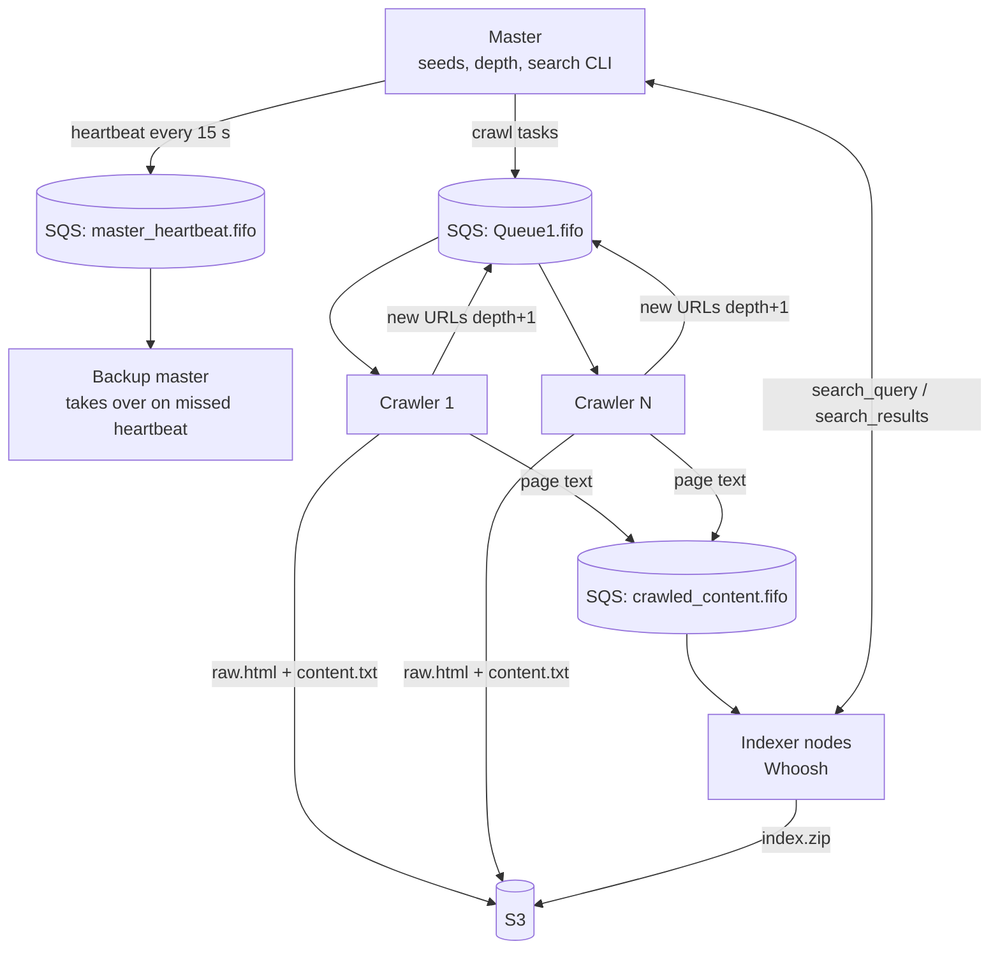

# Distributed Web Crawler & Search Engine on AWS

A fault-tolerant, horizontally scalable crawler and search system. A master node hands out work, any number of crawler and indexer nodes on separate cloud VMs do it, and a **hot-standby master** takes over when the primary dies. All coordination goes through **AWS SQS FIFO queues**. Page content and the finished index live in **S3**.

## Architecture


- **Master (`master.py`):** takes seed URLs and a crawl depth (0–20), turns them into depth-tagged tasks, sends a heartbeat every 15 s, waits for crawler and indexer completion signals, then serves an interactive search CLI. Entering `/.quit` broadcasts a shutdown to every node.
- **Backup master (`master_backup.py`):** long-polls the heartbeat queue. If no heartbeat arrives within the timeout, it promotes itself and resumes coordination.
- **Crawlers (`crawler.py`):** fetch and **JS-render** pages (`requests_html` / headless Chromium), respect **robots.txt**, store the raw HTML and extracted text in S3, and push the outgoing links back onto the queue with `depth + 1` until they reach the maximum.
- **Indexers (`indexer.py`):** build a **Whoosh** full-text index (multi-field, OR-group query parser), answer queries over SQS, and archive the index to S3 at the end.
- Nodes can start **in any order** and **join mid-crawl**. More crawler VMs means more throughput, with no code changes.

## Run
1. Create the SQS FIFO queues (`Queue1`, `crawled_URLs`, `crawled_content`, `crawler_completion`, `index_completion`, `master_heartbeat`, `search_query`, `search_results`, `shutdown`) and an S3 bucket in `eu-north-1`, and give the VMs IAM access to them.
2. On each VM:
```bash
pip install -r requirements.txt
python3 crawler.py        # as many as you like
python3 indexer.py
python3 master_backup.py
python3 master.py         # prompts for seed URLs and depth, then for search queries
```

## What I'd improve
- **No global visited set**, so the same URL can be crawled twice when pages link to each other. I'd add a DynamoDB (or Redis) seen-set with conditional writes.
- **The heartbeat period and the failover timeout are both 15 s**, so one slow heartbeat can trigger a false takeover. The timeout should be a few multiples of the period, with a fencing token so two masters can't both be active.
- **Queue names and the region are hard-coded.** I'd move them to config or environment variables.

## Team & my role
Distributed Computing course project (Ain Shams, Spring 2025), team of 3. I wrote **58 of the 71 commits**, including the master, the heartbeat and failover logic, the crawler and the indexing pipeline. Design report: [`docs/Distributed_Report.pdf`](docs/Distributed_Report.pdf).

## Tech
`Python` · `AWS SQS (FIFO)` · `AWS S3` · `boto3` · `requests_html` / headless Chromium · `BeautifulSoup` · `Whoosh`
